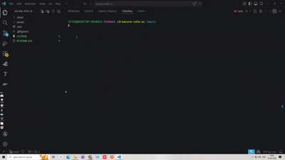

# 🚀 dgit-ai-commit

> AI-powered Git commit CLI using GROQ ⚡
> Generate clean, meaningful, and conventional commit messages instantly.



---

## ✨ Features

* 🤖 AI-generated commit messages (GROQ powered)
* ⚡ Lightning-fast performance
* 🎯 Conventional commit support
* 🔄 Regenerate suggestions instantly
* ✏️ Edit commit message with F2
* 📦 One command for add + commit + push
* 🧠 Smart detection of staged/unstaged changes

---

## 📦 Installation

```bash
npm install -g dgit-ai-commit
```

---

## ⚡ Usage

### Basic Workflow

```bash
dg add
dg commit
dg push
```

### Or Just:

```bash
dg push
```

---

## 🔑 Setup (First Time)

Get your GROQ API key:
👉 [https://console.groq.com/keys](https://console.groq.com/keys)

The CLI will prompt you to enter it on first use.

---

## 🧠 Example Output

```bash
fix: improve dropdown selection styling

- Enhanced UI interaction
- Improved accessibility
```

---

## 🎯 Why dgit-ai-commit?

* Saves time writing commit messages
* Enforces clean commit history
* Beginner-friendly CLI
* Works seamlessly with any Git repo

---

## 📁 Project Structure

```
bin/            → CLI entry
src/            → core logic
components/     → UI helpers
public/         → preview assets
```

---

## 🌍 Keywords

Git commit generator, AI commit message, Git CLI tool, GROQ AI, developer productivity, conventional commits, commit automation

---

## 👨‍💻 Author

**Thinakaran Manokaran**
🌐 [https://thinakaran.dev](https://thinakaran.dev)

---

## 📄 License

MIT License - See [LICENSE](LICENSE) file for details