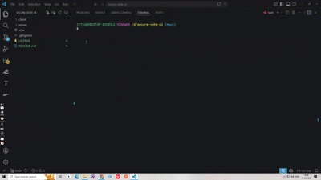

# 🚀 dgit-ai-commit

> AI-powered Git CLI using GROQ ⚡
> Generate clean, meaningful, conventional commit messages — and now,
> describe what you want in plain English and let the AI run the git
> commands for you.



---

## ✨ Features

* 🤖 AI-generated commit messages (GROQ powered)
* 🧠 **NEW: Natural-language git agent** — `dg -a "undo my last commit"`
* ⚡ Lightning-fast performance, with a disk cache so re-running on an
  unchanged diff doesn't re-hit the API
* 🎯 Conventional commit support
* 🔄 Regenerate suggestions instantly
* ✏️ Edit commit message with F2
* 📦 One command for add + commit + push
* 🧠 Smart detection of staged/unstaged changes
* 🛡️ Every git command runs without a shell (no injection risk), and
  destructive agent plans require typing `CONFIRM` before running

---

## 📦 Installation

```bash
npm install -g dgit-ai-commit
```

---

## ⚡ Usage

### Basic Workflow

```bash
dg add
dg commit
dg push
```

### Or Just:

```bash
dg push
```

### 🤖 Natural-language git agent

Describe what you want, and DGit translates it into an ordered git
plan, shows you exactly what it intends to run, and asks for
confirmation before touching anything:

```bash
dg -a "undo my last commit but keep the changes staged"
dg agent "find the commit from 21/06/2026 and reset to it"
```

Every proposed plan shows:
* a plain-English explanation
* the exact `git ...` commands, in order
* a risk badge (`SAFE` / `CAUTION` / `DESTRUCTIVE`)

Destructive plans (history rewrites, force pushes, discarding work)
require typing `CONFIRM` — not just pressing Enter — before anything
runs. The agent will only ever execute `git ...` commands; anything
else in a proposed plan is refused.

---

## 🔑 Setup (First Time)

Get your GROQ API key:
👉 [https://console.groq.com/keys](https://console.groq.com/keys)

The CLI will prompt you to enter it on first use and save it to
`~/.dgconfig.json`. You can also hand-edit that file to override the
models used:

```json
{
  "apiKey": "gsk_...",
  "model": "llama-3.1-8b-instant",
  "agentModel": "llama-3.3-70b-versatile"
}
```

---

## 🧠 Example Output

```bash
fix: improve dropdown selection styling

- Enhanced UI interaction
- Improved accessibility
```

---

## 🎯 Why dgit-ai-commit?

* Saves time writing commit messages
* Enforces clean commit history
* Lets you describe intent instead of memorizing git flags
* Beginner-friendly CLI
* Works seamlessly with any Git repo

---

## 📁 Project Structure

```
bin/
  dg.js              → CLI entry point (Commander wiring only)
src/
  commands/          → one file per CLI command (init, add, commit, push, agent)
  core/               → git.js, ai.js, config.js, cache.js — no UI code here
  ui/                 → banner.js, theme.js, prompts.js, commitFlow.js, setup.js, guards.js
public/               → preview assets
```

---

## 🌍 Keywords

Git commit generator, AI commit message, Git CLI tool, GROQ AI, developer productivity, conventional commits, commit automation, AI git agent

---

## 👨‍💻 Author

**Thinakaran Manokaran**
🌐 [https://thinakaran.dev](https://thinakaran.dev)

---

## 📄 License

MIT License - See [LICENSE](LICENSE) file for details